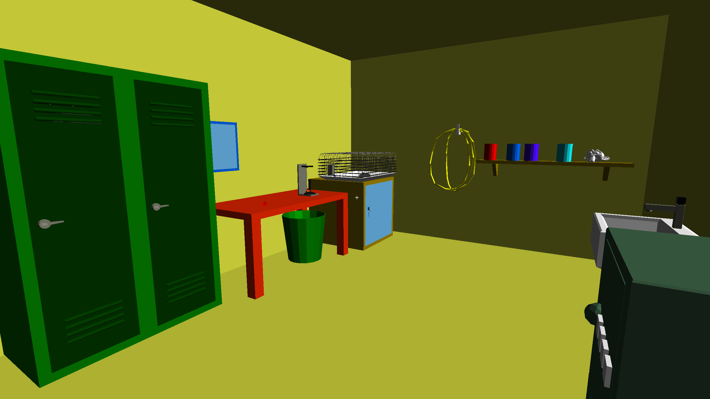

```
 _           _     _____                         
| |         | |   |  ___|                        
| |     __ _| |__ | |__ ___  ___ __ _ _ __   ___ 
| |    / _` | '_ \|  __/ __|/ __/ _` | '_ \ / _ \
| |___| (_| | |_) | |__\__ \ (_| (_| | |_) |  __/
\_____/\__,_|_.__/\____/___/\___\__,_| .__/ \___|
                                     | |         
                                     |_| ver. 1.2
```
The crazy proffessor locked you in his lab,
he planning try his experiment on you,
but he must go lecture students.
As a miracle you leave chair. Now your challenge is
escape the room and find tree evidences of proffesor.


### CONTROLS:
- Move: w a s d
- Look: Mouse
- Interactions: Left mouse click
- Inventory: Mouse wheel
- Game escape: p

### NOTE:
This is an old project that I found on my disk.
This game was created after a few days for a semester project at university.
It was my first ever experience with OpenGL, so I only used the old OpenGL calls.
The game is fully playable and complete.

Author: Martin Krásl 2018


